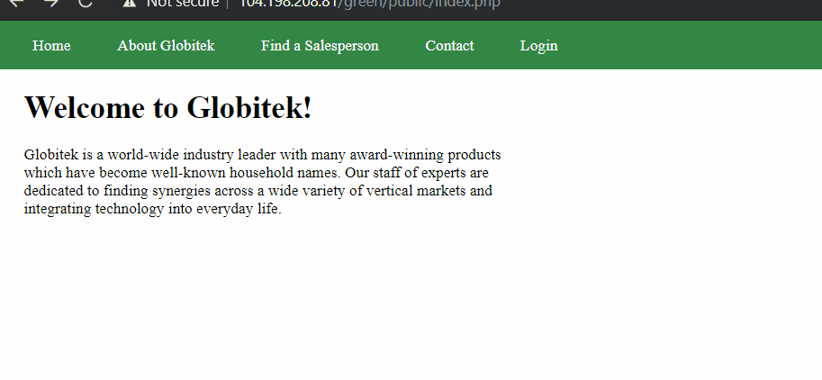

# w9_cp_pentestinglivetargets
Pen-testing different targets using common vulnerabilities
## Objective
from the codepath page:

Get hands-on experience with some of the most common security exploits through an applied hacking exercise.
Your challenge is to attempt to find and exploit the vulnerabilities. The goal is to identify which two vulnerabilities the blue target has, which two vulnerabilities the green target has, and which two vulnerabilities the red target has.

### hours spent:
  ~8 hrs

<b><h3>Green</h3></b>
Vunerability #1: User Enumeration

* Using the given name in the unstaructions "jmonroe99" or "pperson" we can notice that a valid user name, even if the password in incorrect, returns a **bold** error.

* A name not in the database returns a non bold error.

Vulnerability #2: XXS

* This attack is done through the feedback section in the public site.

* The XXS is executed when a user with privileges access the feedback site to check on comments.

**Bonus Objective:** Build on Objective #4 :XXS

Experiment to see if you can use XSS to: a) direct the user to a new URL, b) read cookie data, c) set cookie data.

* This exploit is basically the same as vulnerability for green #2. Through the feedback comment.

* In this case we use replace alert() statement with a window.location.assign(). I redirect the user to duckduckgo.

<b><h3>Red</h3></b>
Vulnerability #1 Insecure Object Reference (IDOR)

* In the 'find a salesperson' page, we directly change the id parameter in the url.

* Id's 10 and 11 were not supposed to be seen by everyone, but are accesible by simply changing the ID number in the url.

<b><h3>Blue</h3></b> 

